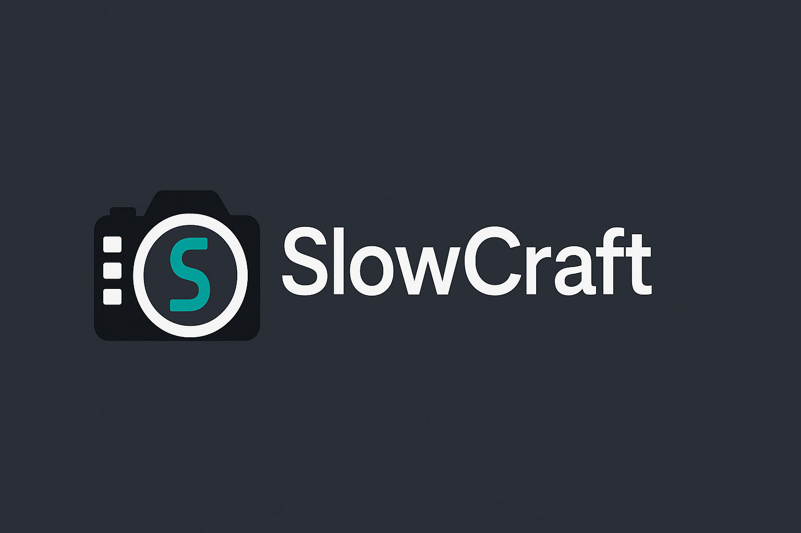
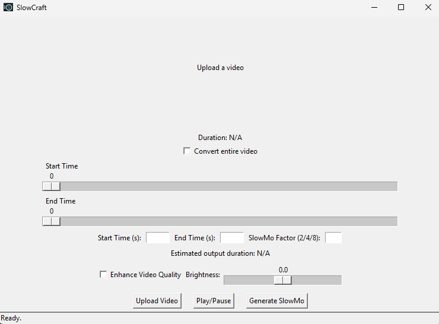
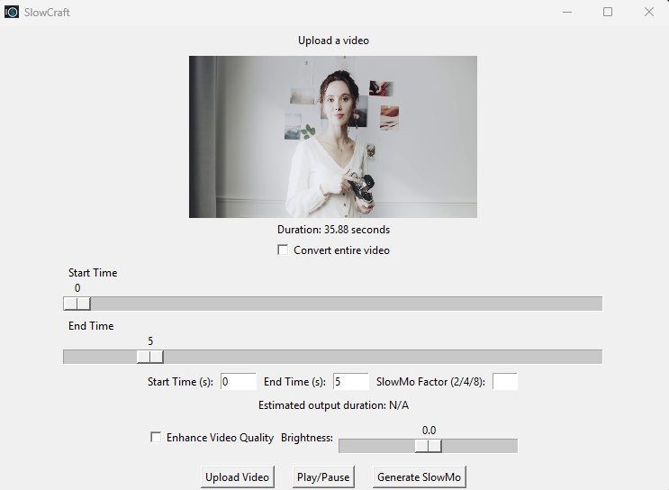
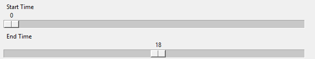
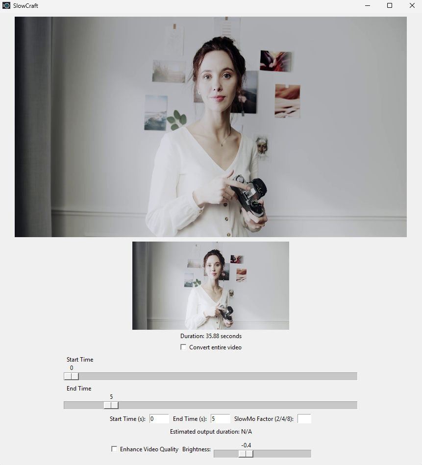
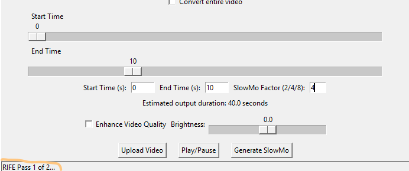
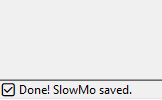

# 🎥 SlowCraft - RIFE SlowMo Generator

**SlowCraft** is a simple desktop app that lets you generate smooth slow-motion videos using the RIFE AI frame interpolation model. Built with Python and Tkinter, it's plug-and-play: just drop in a video, set your settings, and create buttery smooth slowmo.



---

## 🛠 Features

- 📹 Upload any video (`.mp4`, `.avi`, `.mov`)
- 🎛 Choose custom start/end time or process entire video
- 🐢 Slow down by 2x, 4x, or 8x
- 🌟 Optional video enhancement: brightness + sharpening + denoise
- 🖼 Real-time frame preview
- 💾 Export with audio and save anywhere

---

## 🖼 Screenshots

### 🪄 Launch


### 📤 Upload Video


### ⏱ Select Range


### 💡 Brightness Adjustment


### ⚙️ Processing


### ✅ Success


---

## 📦 Requirements

- Python 3.8+
- `ffmpeg.exe` (download below)
- `rife-ncnn-vulkan.exe` (download below)
- RIFE model files (`rife-v4.6`)

---

## ⬇️ Setup Instructions

1. **Clone this repo**
   ```bash
   git clone https://github.com/Garuda8887/slowcraft.git
   cd slowcraft
   ```

2. **Install dependencies**
   ```bash
   pip install -r requirements.txt
   ```

3. **Download these files manually:**
   - `ffmpeg.exe`: [Download from FFmpeg Builds](https://www.gyan.dev/ffmpeg/builds/)
   - `rife-ncnn-vulkan.exe` + `models/rife-v4.6`: [Download from RIFE-NCNN-Vulkan](https://github.com/nihui/rife-ncnn-vulkan/releases)

   Place them in the root folder as shown below.

---

## 📁 Folder Structure

```
slowcraft/
├── slowcraft.py
├── README.md
├── ffmpeg.exe
├── rife-ncnn-vulkan.exe
├── models/
│   └── rife-v4.6/
```

---

## 🚀 Run the App

```bash
python slowcraft.py
```

---

## 🧠 Credits

- [RIFE AI Interpolation](https://github.com/megvii-research/ECCV2022-RIFE)
- [rife-ncnn-vulkan](https://github.com/nihui/rife-ncnn-vulkan)
- UI/UX by [Garuda8887](https://github.com/Garuda8887)

---

## 📃 License

MIT License – use freely, credit kindly.
